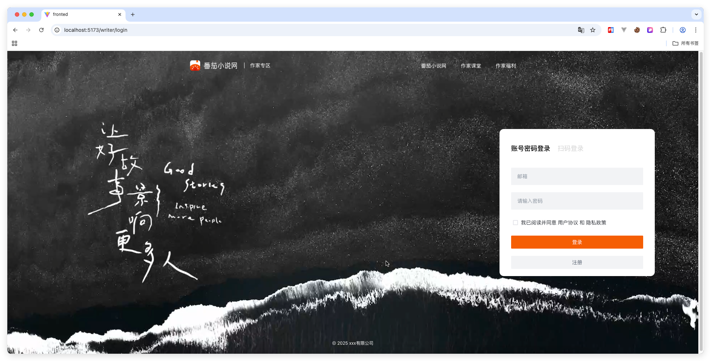

🍅 西红柿小说

这是一个基于 Spring Boot 开发的个人学习项目，目前只实现了核心基础功能，用于学习与实践java。
（注意：暂未添加完善的参数校验与异常处理逻辑。前端大部分用ai写的。问题很多）

✨ 已实现功能
# 🔐 用户注册与登录

    支持使用 邮箱注册与登录
    
    登录与注册过程需要 邮箱验证码
    
    验证码通过 Redis 存储与校验

界面示例：
    

🚧 开发说明

技术栈：Spring Boot、Redis、MySQL

项目主要用于后端开发学习与实验

📚 后续计划

增加数据校验
实现小说上传、阅读、收藏等核心功能